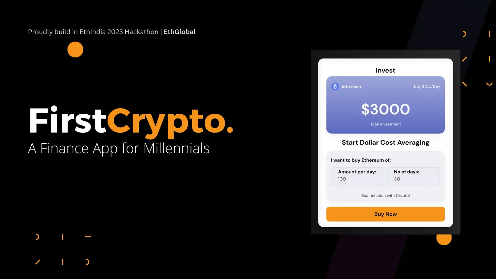
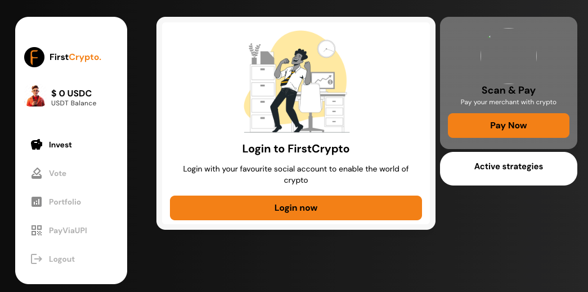

# FirstCrypto - A Finance App for Millennials

**FirstCrypto** is a revolutionary financial application built on blockchain, designed specifically for millennials. By removing technical complexities, FirstCrypto makes investing, managing, and using cryptocurrency as seamless as possible.

## 🌟 Key Features

- **Simplified Onboarding**: Sign up and onboard effortlessly using your **Social Accounts**.
- **Crypto Payments via UPI**: Pay for goods and services with crypto directly through **UPI integration**.
- **Investment Strategies**: Invest in cryptocurrency through curated strategies tailored for millennials.
- **All-in-One Platform**: Access payments, investments, and financial tools in a single app.

## 🚀 How It Works

1. **Onboard Easily**: Use social accounts to create your profile and start your journey.
2. **Pay Using Crypto**: Utilize crypto for payments through UPI, blending the worlds of blockchain and traditional finance.
3. **Invest Strategically**: Access personalized investment strategies, tailored to maximize your returns.
4. **Enjoy the Simplicity**: Manage your crypto and financial activities with a user-friendly interface.

## 🛠️ Tech Stack

- **Frontend**: Modern and interactive UI/UX, optimized for financial interactions.
- **Backend**: Secure APIs for handling user data, crypto payments, and investment strategies.
- **Blockchain**: Leveraging blockchain technology to ensure secure and transparent transactions.

## 🔗 Live Demo

Explore the project and its features by visiting the GitHub repository:  
[FirstCrypto on GitHub](https://github.com/tahirahmadin/first-crypto-app)

## 📸 Screenshots

| Onboarding Screen                | Investment Strategies Screen |
| -------------------------------- | ---------------------------- |
|  |   |

## 🤝 Contribution

We welcome contributions to help improve and enhance FirstCrypto. To contribute:

1. Fork the repository.
2. Create a feature branch.
3. Make your changes and submit a pull request.

## 📝 License

This project is licensed under the MIT License. See the [LICENSE](LICENSE) file for details.

## 📧 Contact

For any queries or collaborations, feel free to reach out:

- Devfolio: [FirstCrypto](https://devfolio.co/projects/firstcrypto-a-finance-app-for-millennials-8130)
- GitHub Repository: [FirstCrypto on GitHub](https://github.com/tahirahmadin/first-crypto-app)
